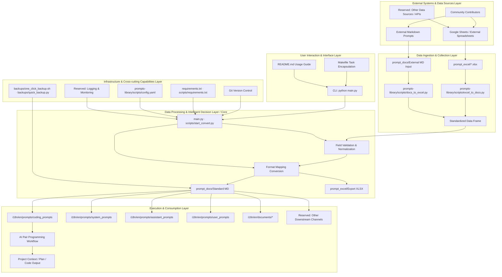
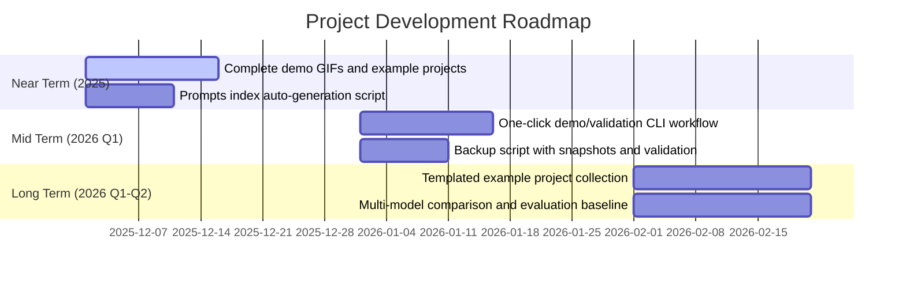

<!--
-------------------------------------------------------------------------------
  PROJECT HEADER SECTION
-------------------------------------------------------------------------------
-->
<p align="center">
  <!-- Recommended size: 1280x640px. Created using Canva, Figma, or https://banners.beyondco.de/ -->
  
</p>

<div align="center">

# Vibe Coding Guide

**The ultimate workstation for turning ideas into reality through AI pair programming**

---

<!--
  BADGES SECTION
-->
<!-- Project Status Badges -->
<p>
  <a href="https://github.com/tukuaiai/vibe-coding-cn/actions"></a>
  <a href="https://github.com/tukuaiai/vibe-coding-cn/releases"></a>
  <a href="LICENSE"></a>
  <a href="https://github.com/tukuaiai/vibe-coding-cn"></a>
  <a href="https://github.com/tukuaiai/vibe-coding-cn"></a>
  <a href="https://github.com/tukuaiai/vibe-coding-cn/graphs/contributors"></a>
  <a href="https://t.me/glue_coding"></a>
</p>

<!-- Multi-language Entry Points -->
<p>
  <a href="./i18n/zh/README.md"></a>
  <a href="./i18n/en/README.md"></a>
  <a href="./i18n/he/"></a>
  <a href="./i18n/ar/"></a>
  <a href="./i18n/bn/"></a>
  <a href="./i18n/de/"></a>
  <a href="./i18n/es/"></a>
  <a href="./i18n/fa/"></a>
  <a href="./i18n/fr/"></a>
  <a href="./i18n/ha/"></a>
  <a href="./i18n/hi/"></a>
  <a href="./i18n/id/"></a>
  <a href="./i18n/it/"></a>
  <a href="./i18n/ja/"></a>
  <a href="./i18n/ko/"></a>
  <a href="./i18n/ms/"></a>
  <a href="./i18n/nl/"></a>
  <a href="./i18n/pl/"></a>
  <a href="./i18n/pt/"></a>
  <a href="./i18n/ru/"></a>
  <a href="./i18n/sw/"></a>
  <a href="./i18n/ta/"></a>
  <a href="./i18n/th/"></a>
  <a href="./i18n/tr/"></a>
  <a href="./i18n/uk/"></a>
  <a href="./i18n/ur/"></a>
  <a href="./i18n/vi/"></a>
</p>

<!-- Resource Quick Links -->
<p>
  <a href="./i18n/en/prompts/"></a>
  <a href="./i18n/en/skills/"></a>
  <a href="./libs/external/prompts-library/prompt_docs/"></a>
  <a href="https://docs.google.com/spreadsheets/d/1ngoQOhJqdguwNAilCl1joNwTje7FWWN9WiI2bo5VhpU/edit?gid=2093180351#gid=2093180351&range=A1"></a>
  <a href="https://github.com/x1xhlol/system-prompts-and-models-of-ai-tools"></a>
</p>

[📚 Documentation & Resources](#-documentation--resources)
[🚀 Getting Started](#-getting-started)
[⚙️ Complete Setup](#️-complete-setup)
[📞 Contact](#-contact)
[✨ Support the Project](#-support-the-project)
[🤝 Contributing](#-contributing)

AI-powered repository analysis: [zread.ai/tukuaiai/vibe-coding-cn](https://zread.ai/tukuaiai/vibe-coding-cn/1-overview)

</div>

---

## 🔑 Meta-Methodology

The core idea is to build a **self-optimizing** AI system. Its recursive nature can be broken down into the following steps:

> Extended Reading: [A Formalization of Recursive Self-Optimizing Generative Systems](./i18n/en/documents/Methodology%20and%20Principles/A%20Formalization%20of%20Recursive%20Self-Optimizing%20Generative%20Systems.md)

#### 1. Define Core Roles:

*   **α-Prompt (Generator)**: A "mother" prompt whose sole responsibility is to **generate** other prompts or skills.
*   **Ω-Prompt (Optimizer)**: Another "mother" prompt whose sole responsibility is to **optimize** other prompts or skills.

#### 2. Describe the Recursive Lifecycle:

1.  **Bootstrap**:
    *   Use AI to generate initial versions (v1) of `α-Prompt` and `Ω-Prompt`.

2.  **Self-Correction & Evolution**:
    *   Use `Ω-Prompt (v1)` to **optimize** `α-Prompt (v1)`, resulting in a more powerful `α-Prompt (v2)`.

3.  **Generation**:
    *   Use the **evolved** `α-Prompt (v2)` to generate all required target prompts and skills.

4.  **Recursive Loop**:
    *   Feed the newly generated, more powerful outputs (including new versions of `Ω-Prompt`) back into the system to optimize `α-Prompt` again, launching continuous evolution.

#### 3. Ultimate Goal:

Through this continuous **recursive optimization loop**, the system achieves **self-transcendence** with each iteration, infinitely approaching the preset **expected state**.

## 🧭 The Way (Dao)

* **Let AI do whatever it can; don't do it manually**
* **Ask AI for all questions**
* **Purpose-driven: Every action in development revolves around the "purpose"**
* **Context is the first principle of Vibe Coding; garbage in, garbage out**
* **Think systematically: entities, links, and functions/purposes—three dimensions**
* **Data and functions are everything in programming**
* **Input, processing, output—these characterize the entire process**
* **Ask AI: What is it? Why? How to do it?**
* **Structure first, code second—always plan the framework well, or you'll never finish paying off technical debt**
* **Occam's Razor: If unnecessary, don't add code**
* **Pareto Principle: Focus on the important 20%**
* **Think backwards: Clearly define your requirements first, then build code backwards from requirements**
* **Repetition: Try several times; if it doesn't work, open a new window**
* **Focus: Extreme focus can break through code—do one thing at a time (unless you're superhuman)**


## 🧩 The Method (Fa)

* **One-sentence goal + non-goals**
* **Orthogonality: Don't duplicate functions too much (context-dependent)**
* **Copy before writing—don't reinvent the wheel; first ask AI if there's a suitable repo, download and modify it**
* **Always read official documentation—first download and feed official docs to AI**
* **Split modules by responsibility**
* **Interface first, implementation later**
* **Change only one module at a time**
* **Documentation is context, not an afterthought**

## 🛠️ The Technique (Shu)

* Clearly specify: **What can be changed, what cannot be changed**
* Debug by providing only: **Expected vs. actual + minimal reproduction**
* Testing can be delegated to AI, **assertions reviewed by humans**
* When code gets too long, **switch sessions**

## 📋 Tools (Qi)

### Integrated Development Environments (IDEs) & Terminals

*   [**Visual Studio Code**](https://code.visualstudio.com/): A powerful integrated development environment suitable for code reading and manual modifications. Its `Local History` plugin is particularly convenient for project version management.
*   **Virtual Environment (.venv)**: Highly recommended for one-click project environment configuration and isolation, especially for Python development.
*   [**Cursor**](https://cursor.com/): Has already captured user mindshare and is well-known by everyone.
*   [**Warp**](https://www.warp.dev/): A modern terminal with integrated AI features that effectively improves command-line operations and error troubleshooting efficiency.
*   [**Neovim (nvim)**](https://github.com/neovim/neovim): A high-performance modern Vim editor with a rich plugin ecosystem, the first choice for keyboard-driven developers.
*   [**LazyVim**](https://github.com/LazyVim/LazyVim): A configuration framework based on Neovim with pre-configured LSP, code completion, debugging, and other complete features, achieving a balance between out-of-the-box and deep customization.

### AI Models & Services

*   [**Claude Opus 4.5**](https://claude.ai/new): A powerful AI model, available through platforms like Claude Code, with support for CLI and IDE plugins.
*   [**gpt-5.1-codex.1-codex (xhigh)**](https://chatgpt.com/codex/): Suitable for handling large projects and complex logic, accessible via Codex CLI and other platforms.
*   [**Droid**](https://factory.ai/news/terminal-bench): Provides CLI access to Claude Opus 4.5 and other models.
*   [**Kiro**](https://kiro.dev/): Currently offers free access to Claude Opus 4.5 model, with client and CLI tools available.
*   [**Gemini CLI**](https://geminicli.com/): Provides free access to Gemini models, suitable for running scripts, organizing documents, and exploring ideas.
*   [**antigravity**](https://antigravity.google/): Currently a free AI service provided by Google, supporting Claude Opus 4.5 and Gemini 3.0 Pro.
*   [**AI Studio**](https://aistudio.google.com/prompts/new_chat): A free service provided by Google, supporting Gemini 3.0 Pro and Nano Banana.
*   [**Gemini Enterprise**](https://cloud.google.com/gemini-enterprise): Google's AI service for enterprise users, currently available for free.
*   [**GitHub Copilot**](https://github.com/copilot): An AI code completion tool jointly developed by GitHub and OpenAI.
*   [**Kimi K2**](https://www.kimi.com/): A domestic Chinese AI model suitable for various routine tasks.
*   [**GLM**](https://bigmodel.cn/): A domestic large language model developed by Zhipu AI.
*   [**Qwen**](https://qwenlm.github.io/qwen-code-docs/zh/cli/): An AI model developed by Alibaba, whose CLI tool provides free usage credits.

### Development & Auxiliary Tools

*   [**Augment**](https://app.augmentcode.com/): Provides powerful context engine and prompt optimization features.
*   [**Windsurf**](https://windsurf.com/): An AI development tool that provides free credits for new users.
*   [**Ollama**](https://ollama.com/): A local large model management tool that allows convenient pulling and running of open-source models via command line.
*   [**Mermaid Chart**](https://www.mermaidchart.com/): Used to convert text descriptions into visual charts such as architecture diagrams and sequence diagrams.
*   [**NotebookLM**](https://notebooklm.google.com/): A tool for AI interpretation of materials, audio, and mind map generation.
*   [**Zread**](https://zread.ai/): An AI-driven GitHub repository reading tool that helps quickly understand project code.
*   [**tmux**](https://github.com/tmux/tmux): A powerful terminal multiplexer supporting session persistence, split screens, and background tasks—ideal for servers and multi-project development.
*   [**DBeaver**](https://dbeaver.io/): A universal database management client supporting multiple databases with comprehensive features.

### Resources & Templates

*   [**Prompt Library (Online Spreadsheet)**](https://docs.google.com/spreadsheets/d/1ngoQOhJqdguwNAilCl1joNwTje7FWWN9WiI2bo5VhpU/edit?gid=2093180351#gid=2093180351&range=A1): An online spreadsheet containing a large number of directly usable prompts for various scenarios.
*   [**Third-party System Prompts Learning Repository**](https://github.com/x1xhlol/system-prompts-and-models-of-ai-tools): For learning and referencing system prompts from other AI tools.
*   [**Skills Maker**](https://github.com/yusufkaraaslan/Skill_Seekers): A tool that can generate customized Skills based on requirements.
*   [**Meta Prompts**](https://docs.google.com/spreadsheets/d/1ngoQOhJqdguwNAilCl1joNwTje7FWWN9WiI2bo5VhpU/edit?gid=1770874220#gid=1770874220): Advanced prompts for generating other prompts.
*   [**Universal Project Architecture Template**](./i18n/en/documents/Templates%20and%20Resources/General_Project_Architecture_Template.md): Can be used to quickly set up standardized project directory structures.
*   [**Meta-Skill: The Skill of Skills**](./i18n/en/skills/claude-skills/SKILL.md): A meta-skill for generating other Skills.
*   [**tmux Shortcut Key Reference**](./i18n/en/documents/Tutorials%20and%20Guides/tmux_Shortcut_Cheatsheet.md): Shortcut key reference documentation for tmux.
*   [**LazyVim Shortcut Key Reference**](./i18n/en/documents/Tutorials%20and%20Guides/LazyVim_Shortcut_Cheatsheet.md): Shortcut key reference documentation for LazyVim.
*   [**Second Brother's Java Advanced Road**](https://javabetter.cn/): Contains detailed configuration tutorials for various development tools.
*   [**Virtual Cards**](https://www.bybit.com/cards/?ref=YDGAVPN&source=applet_invite): Can be used for scenarios requiring international payments such as registering cloud services.

---

## Coding Model Performance Tier Reference

It is recommended to select only first-tier models for handling complex tasks to ensure optimal results and efficiency.

*   **First Tier**: `codex-5.1-max-xhigh`, `claude-opus-4.5-xhigh`, `gpt-5.2-xhigh`
*   **Second Tier**: `claude-sonnet-4.5`, `kimi-k2-thinking`, `minimax-m2`, `glm-4.6`, `gemini-3.0-pro`, `gemini-2.5-pro`
*   **Third Tier**: `qwen3`, `SWE`, `grok4`

---

## 📚 Related Documentation & Resources

*   **Community**:
    *   [Telegram Discussion Group](https://t.me/glue_coding)
    *   [Telegram Channel](https://t.me/tradecat_ai_channel)
*   **Personal Sharing**:
    *   [My Learning Experience](./i18n/en/documents/Methodology%20and%20Principles/Learning_Experience.md)
    *   [Programming Book Recommendations](./i18n/en/documents/Templates%20and%20Resources/Recommended_Programming_Books.md)
*   **Core Resources**:
    *   [**Meta Prompt Library**](https://docs.google.com/spreadsheets/d/1ngoQOhJqdguwNAilCl1joNwTje7FWWN9WiI2bo5VhpU/edit?gid=1770874220#gid=1770874220): A collection of advanced prompts for generating other prompts.
    *   [**Meta-Skill**](./i18n/en/skills/claude-skills/SKILL.md): A Skill for generating other Skills.
    *   [**Skills Library**](./i18n/en/skills): A repository of directly integrable modular skills.
    *   [**Skills Generator**](https://github.com/yusufkaraaslan/Skill_Seekers): A tool to convert any material into Agent-usable skills.
    *   [**Online Prompt Database**](https://docs.google.com/spreadsheets/d/1ngoQOhJqdguwNAilCl1joNwTje7FWWN9WiI2bo5VhpU/edit?gid=2093180351#gid=2093180351&range=A1): An online spreadsheet containing hundreds of user and system prompts suitable for various scenarios.
    *   [**Third-party System Prompts Repository**](https://github.com/x1xhlol/system-prompts-and-models-of-ai-tools): A collection of system prompts from various AI tools.
*   **Internal Project Documentation**:
    *   [**prompts-library Tool Description**](./libs/external/prompts-library/): This tool supports converting prompts between Excel and Markdown formats and contains hundreds of curated prompts.
    *   [**coding_prompts Collection**](./i18n/en/prompts/coding_prompts/): Specialized prompts for the Vibe Coding workflow.
    *   [**System Prompt Construction Principles**](./i18n/en/documents/Methodology%20and%20Principles/System_Prompt_Construction_Principles.md): A comprehensive guide on building efficient and reliable AI system prompts.
    *   [**Development Experience Summary**](./i18n/en/documents/Methodology%20and%20Principles/Development_Experience.md): Contains practical experience on variable naming, file structure, coding standards, architectural principles, etc.
    *   [**Universal Project Architecture Template**](./i18n/en/documents/Templates%20and%20Resources/General_Project_Architecture_Template.md): Provides standard directory structures and best practices for various project types.
    *   [**Augment MCP Configuration Documentation**](./i18n/en/documents/Tutorials%20and%20Guides/auggie_mcp_Configuration_Document.md): Detailed configuration instructions for the Augment context engine.
    *   [**system_prompts Collection**](./i18n/en/prompts/system_prompts/): System prompts for guiding AI development, including multiple versions of development specifications and thinking frameworks.

---

### Project Directory Structure Overview

The core structure of the `vibe-coding-cn` project mainly revolves around knowledge management, AI prompt organization, and automation. Below is the organized and simplified directory tree with descriptions for each part:

```
.
├── CODE_OF_CONDUCT.md           # Community code of conduct, regulating contributor behavior.
├── CONTRIBUTING.md              # Contribution guidelines, explaining how to contribute to this project.
├── GEMINI.md                    # Context document for AI assistants, including project overview, tech stack, and file structure.
├── LICENSE                      # Open source license file.
├── Makefile                     # Project automation scripts for code checking, building, etc.
├── README.md                    # Main project documentation, including project overview, usage guide, resource links, etc.
├── .gitignore                   # Git ignore file.
├── AGENTS.md                    # Documentation or configuration related to AI agents.
├── CLAUDE.md                    # Core behavior rules or configuration for AI assistants.
│
├── i18n/en/documents/           # Various documentation, experience summaries, and detailed configuration instructions.
│   ├── Methodology and Principles/ # Methodology and principles
│   ├── Templates and Resources/    # Templates and resources
│   └── Tutorials and Guides/       # Tutorials and guides
│
├── libs/                        # Common library code for internal project modularity.
│   ├── common/                  # Common functionality modules.
│   │   ├── models/              # Model definitions.
│   │   │   └── __init__.py
│   │   └── utils/               # Utility functions.
│   │       └── backups/         # Internal backup tools.
│   ├── database/                # Database-related modules.
│   │   └── .gitkeep             # Placeholder file to ensure Git tracks the directory.
│   └── external/                # External integration modules.
│       ├── my-nvim/             # User's Neovim configuration.
│       ├── prompts-library/     # Prompt library management tool (Excel-Markdown conversion).
│       │   ├── main.py          # Main entry point for prompt library management tool.
│       │   ├── scripts/         # Contains Excel-Markdown conversion scripts and configurations.
│       │   ├── prompt_excel/    # Stores Excel format raw prompt data.
│       │   ├── prompt_docs/     # Stores Markdown prompt documents converted from Excel.
│       │   └── ... (other prompts-library internal files)
│       └── XHS-image-to-PDF-conversion/ # Xiaohongshu (Little Red Book) image to PDF tool.
│
├── i18n/en/prompts/             # Centrally stores all types of AI prompts.
│   ├── assistant_prompts/       # Assistant-type prompts.
│   ├── coding_prompts/          # Prompt collection specifically for programming and code generation.
│   │   └── ... (specific programming prompt files)
│   │
│   ├── system_prompts/          # AI system-level prompts for setting AI behavior and frameworks.
│   │   └── ... (other system prompts)
│   │
│   └── user_prompts/            # User-defined or commonly used prompts.
│       ├── ASCII_Art_Generation.md         # ASCII art generation prompts.
│       ├── Data_Pipeline.md            # Data pipeline processing prompts.
│       └── ... (other user prompts)
│
├── i18n/en/skills/              # Centrally stores all types of skill skills.
    ├── claude-skills            # Meta SKILL for generating SKILLs
    │   ├── SKILL.md
    │   └── ... (others)
    └── ... (and other skills)
```

---

## 🖼️ Overview & Demo

In one sentence: Vibe Coding = **Planning-driven + Context-locked + AI Pair Execution**, turning "from idea to maintainable code" into an auditable pipeline, not an unmanageable monolithic file.

**What you'll get**
- A systematic prompt toolchain: `i18n/en/prompts/system_prompts/` constrains AI behavior boundaries, `i18n/en/prompts/coding_prompts/` provides full-chain scripts for requirement clarification, planning, and execution.
- Closed-loop delivery path: Requirements → Context documentation → Implementation plan → Step-by-step implementation → Self-testing → Progress tracking, fully reviewable and transferable.

## ⚙️ Architecture & Workflow

Core asset mapping:
```
i18n/en/prompts/
  coding_prompts/        # Core prompts for requirement clarification, planning, and execution chain
  system_prompts/        # System-level prompts constraining AI behavior boundaries
  assistant_prompts/     # Auxiliary/collaborative prompts
  user_prompts/          # Reusable user-side prompts
i18n/en/documents/
  Templates and Resources/Code_Organization.md, Templates and Resources/General_Project_Architecture_Template.md, Methodology and Principles/Development_Experience.md, Methodology and Principles/System_Prompt_Construction_Principles.md, etc. knowledge base
backups/
  one_click_backup.sh, quick_backup.py  # Local/remote snapshot scripts
```



---

<details>
<summary>📈 Performance Benchmarks (Optional)</summary>

This repository is positioned as a "workflow and prompts" rather than a performance-focused codebase. It is recommended to track the following observable metrics (currently mainly relying on manual recording; scores/traces can be kept in `progress.md`):

| Metric | Meaning | Current Status/Recommendation |
|:---|:---|:---|
| Prompt Hit Rate | Proportion that meets acceptance criteria on first generation | To be recorded; mark 0/1 in progress.md after each task completion |
| Turnaround Time | Time required from requirement to first runnable version | Mark timestamps in screen recordings, or use CLI timer for statistics |
| Change Reviewability | Whether context/progress/backups are synchronously updated | Through manual updates; can add git tag/snapshots in backup scripts |
| Routine Coverage | Whether there are minimal runnable examples/test cases | Recommend each example project retains README+test cases |

</details>

---

## 🗺️ Roadmap



---

## 🚀 Getting Started (Original author's guide, updated by me with what I believe are the best models)
To start Vibe Coding, you only need one of the following two tools:
- **Claude Opus 4.5**, used in Claude Code
- **gpt-5.1-codex.1-codex (xhigh)**, used in Codex CLI

This guide applies to both CLI terminal versions and VSCode extension versions (both Codex and Claude Code have extensions with updated interfaces).

*(Note: Early versions of this guide used **Grok 3**, later switched to **Gemini 2.5 Pro**, and now we use **Claude 4.5** (or **gpt-5.1-codex.1-codex (xhigh)**))*

*(Note 2: If you want to use Cursor, check out version [1.1](https://github.com/EnzeD/vibe-coding/tree/1.1.1) of this guide, but we believe it's currently not as powerful as Codex CLI or Claude Code)*

---

<details>
<summary><strong>⚙️ Complete Setup Process</strong></summary>

<details>
<summary><strong>1. Game Design Document (GDD)</strong></summary>

- Give your game idea to **gpt-5.1-codex** or **Claude Opus 4.5**, and have it generate a concise **Game Design Document** in Markdown format, named `game-design-document.md`.
- Review and refine it yourself to ensure it aligns with your vision. It can be rough initially; the goal is to provide AI with context about the game structure and intent. Don't over-design; you'll iterate later.
</details>

<details>
<summary><strong>2. Tech Stack & <code>CLAUDE.md</code> / <code>Agents.md</code></strong></summary>

- Have **gpt-5.1-codex** or **Claude Opus 4.5** recommend the most suitable tech stack for your game (e.g., ThreeJS + WebSocket for multiplayer 3D games), save as `tech-stack.md`.
  - Ask it to propose the **simplest but most robust** tech stack.
- Open **Claude Code** or **Codex CLI** in the terminal, use the `/init` command, and it will read the two .md files you've created and generate a set of rules to properly guide the large model.
- **Key: Always review the generated rules.** Ensure rules emphasize **modularity** (multiple files) and prohibit **monolithic giant files**. You may need to manually modify or supplement rules.
  - **Extremely important:** Some rules must be set to **"Always"** (always apply), ensuring AI is forced to read them before generating any code. For example, add the following rules and mark them as "Always":
    > ```
    > # Important reminders:
    > # Must fully read memory-bank/@architecture.md (contains complete database structure) before writing any code
    > # Must fully read memory-bank/@game-design-document.md before writing any code
    > # Must update memory-bank/@architecture.md after completing each major feature or milestone
    > ```
  - Other (non-Always) rules should guide AI to follow best practices for your tech stack (e.g., networking, state management, etc.).
  - *If you want the cleanest code and most optimized project, this entire rule setup is mandatory.*
</details>

<details>
<summary><strong>3. Implementation Plan</strong></summary>

- Provide the following to **gpt-5.1-codex** or **Claude Opus 4.5**:
  - Game Design Document (`game-design-document.md`)
  - Tech stack recommendation (`tech-stack.md`)
- Have it generate a detailed **Implementation Plan** (Markdown format) containing a series of step-by-step instructions for AI developers.
  - Each step should be small and specific.
  - Each step must include tests to verify correctness.
  - No code allowed—only clear, specific instructions.
  - Focus first on the **basic game**; add complete features later.
</details>

<details>
<summary><strong>4. Memory Bank</strong></summary>

- Create a new project folder and open it in VSCode.
- Create a `memory-bank` subfolder in the project root.
- Place the following files in `memory-bank`:
  - `game-design-document.md`
  - `tech-stack.md`
  - `implementation-plan.md`
  - `progress.md` (create a new empty file for recording completed steps)
  - `architecture.md` (create a new empty file for documenting what each file does)
</details>

</details>

<details>
<summary><strong>🎮 Developing a Basic Game with Vibe Coding</strong></summary>

Now for the most exciting phase!

<details>
<summary><strong>Ensure Everything is Clear</strong></summary>

- Open **Codex** or **Claude Code** in the VSCode extension, or start Claude Code / Codex CLI in the project terminal.
- Prompt: Read all documents in `/memory-bank`, is `implementation-plan.md` completely clear? What questions do you have that I need to clarify to make it 100% clear for you?
- It will usually ask 9-10 questions. After answering all of them, have it revise `implementation-plan.md` based on your answers to make the plan more complete.
</details>

<details>
<summary><strong>Your First Implementation Prompt</strong></summary>

- Open **Codex** or **Claude Code** (extension or terminal).
- Prompt: Read all documents in `/memory-bank`, then execute step 1 of the implementation plan. I'll be responsible for running tests. Don't start step 2 until I've verified the tests pass. After verification passes, open `progress.md` to record what you did for future developers' reference, then add new architectural insights to `architecture.md` explaining what each file does.
- **Always** use "Ask" mode or "Plan Mode" first (press `shift+tab` in Claude Code), confirm you're satisfied, then let AI execute the step.
- **Ultimate Vibe:** Install [Superwhisper](https://superwhisper.com), chat casually with Claude or gpt-5.1-codex using voice without typing.
</details>

<details>
<summary><strong>Workflow</strong></summary>

- After completing step 1:
  - Commit changes to Git (ask AI if you don't know how).
  - Start a new chat (`/new` or `/clear`).
  - Prompt: Read all files in memory-bank, read progress.md to understand previous work progress, then continue with step 2 of the implementation plan. Don't start step 3 until I verify the tests.
- Repeat this process until the entire `implementation-plan.md` is complete.
</details>

</details>

<details>
<summary><strong>✨ Adding Detail Features</strong></summary>

Congratulations! You've built a basic game! It may still be rough and lacking features, but now you can experiment and polish it freely.
- Want fog effects, post-processing, special effects, sound effects? Better planes/cars/castles? Beautiful skies?
- For each major feature you add, create a new `feature-implementation.md` with short steps + tests.
- Continue incremental implementation and testing.

</details>

<details>
<summary><strong>🐞 Bug Fixes & Getting Unstuck</strong></summary>

<details>
<summary><strong>Regular Fixes</strong></summary>

- If a prompt fails or breaks the project:
  - In Claude Code use `/rewind` to roll back; with gpt-5.1-codex commit to git frequently and reset when needed.
- Error handling:
  - **JavaScript errors:** Open browser console (F12), copy the error, paste to AI; screenshot visual issues for it.
  - **Lazy method:** Install [BrowserTools](https://browsertools.agentdesk.ai/installation) to automatically copy errors and screenshots.
</details>

<details>
<summary><strong>Difficult Issues</strong></summary>

- Really stuck:
  - Roll back to the previous git commit (`git reset`), retry with a new prompt.
- Extremely stuck:
  - Use [RepoPrompt](https://repoprompt.com/) or [uithub](https://uithub.com/) to combine the entire codebase into one file, then ask **gpt-5.1-codex or Claude** for help.
</details>

</details>

<details>
<summary><strong>💡 Tips & Tricks</strong></summary>

<details>
<summary><strong>Claude Code & Codex Usage Tips</strong></summary>

- **Terminal Claude Code / Codex CLI:** Run in VSCode terminal to see diffs directly, feed context without leaving your workspace.
- **Claude Code's `/rewind`:** One-click rollback to a previous state when iterations go off track.
- **Custom commands:** Create shortcut commands like `/explain $parameter` that trigger prompts: "Analyze the code in depth, thoroughly understand how $parameter works. Tell me when you understand, then I'll give you a task." Let the model maximize context before modifying code.
- **Clean context:** Frequently use `/clear` or `/compact` (keeps conversation history).
- **Time-saving method (at your own risk):** Use `claude --dangerously-skip-permissions` or `codex --yolo` to completely disable confirmation dialogs.
</details>

<details>
<summary><strong>Other Practical Tips</strong></summary>

- **Small changes:** Use gpt-5.1-codex (medium)
- **Write top-tier marketing copy:** Use Opus 4.1
- **Generate excellent 2D sprites:** Use ChatGPT + Nano Banana
- **Generate music:** Use Suno
- **Generate sound effects:** Use ElevenLabs
- **Generate videos:** Use Sora 2
- **Improve prompt effectiveness:**
  - Add a line: "Think slowly, no rush, the important thing is to strictly follow what I say and execute perfectly. If my expression isn't precise enough, please ask questions."
  - Keywords in Claude Code to trigger deep thinking in order of strength: `think` < `think hard` < `think harder` < `ultrathink`.
</details>

</details>

<details>
<summary><strong>❓ Frequently Asked Questions (FAQ)</strong></summary>

- **Q: I'm building an app, not a game—is the process the same?**
  - **A:** Essentially yes! Just replace GDD with PRD (Product Requirements Document). You can also first use v0, Lovable, Bolt.new for quick prototyping, then move the code to GitHub, clone locally, and continue development with this guide.

- **Q: Your fighter jet model in the aerial combat game is amazing, but I can't make it with one prompt!**
  - **A:** That wasn't one prompt, it was ~30 prompts + a dedicated `plane-implementation.md` file for guidance. Use precise instructions like "cut out space for ailerons on the wings" instead of vague commands like "make a plane".

- **Q: Why are Claude Code or Codex CLI better than Cursor now?**
  - **A:** It's completely a matter of personal preference. What we emphasize is: Claude Code better utilizes the power of Claude Opus 4.5, Codex CLI better utilizes the power of gpt-5.1-codex, while Cursor doesn't leverage either as well as the native terminal versions. Terminal versions also work in any IDE, on SSH remote servers, etc., and features like custom commands, sub-agents, hooks, etc. can significantly improve development quality and speed over the long term. Finally, even if you only have a basic Claude or ChatGPT subscription, it's completely sufficient.

- **Q: I don't know how to set up a multiplayer game server—what do I do?**
  - **A:** Ask your AI.

</details>

---

## 📞 Contact Information

-   **GitHub**: [tukuaiai](https://github.com/tukuaiai)
-   **Twitter / X**: [123olp](https://x.com/123olp)
-   **Telegram**: [@desci0](https://t.me/desci0)
-   **Telegram Discussion Group**: [glue_coding](https://t.me/glue_coding)
-   **Telegram Channel**: [tradecat_ai_channel](https://t.me/tradecat_ai_channel)
-   **Email**: tukuai.ai@gmail.com (Responses may be delayed)

---

## ✨ Support the Project

Help support this project—thank you, and may good fortune be with you! 🙏🙏🙏

-   **Tron (TRC20)**: `TQtBXCSTwLFHjBqTS4rNUp7ufiGx51BRey`
-   **Solana**: `HjYhozVf9AQmfv7yv79xSNs6uaEU5oUk2USasYQfUYau`
-   **Ethereum (ERC20)**: `0xa396923a71ee7D9480b346a17dDeEb2c0C287BBC`
-   **BNB Smart Chain (BEP20)**: `0xa396923a71ee7D9480b346a17dDeEb2c0C287BBC`
-   **Bitcoin**: `bc1plslluj3zq3snpnnczplu7ywf37h89dyudqua04pz4txwh8z5z5vsre7nlm`
-   **Sui**: `0xb720c98a48c77f2d49d375932b2867e793029e6337f1562522640e4f84203d2e`
-   **Binance UID**: `572155580`

---

### ✨ Contributors

Thanks to all the developers who have contributed to this project!

<a href="https://github.com/tukuaiai/vibe-coding-cn/graphs/contributors">
  
  
</a>

<p>Special thanks to the following members for their valuable contributions (in no particular order):<br/>
<a href="https://x.com/shao__meng">@shao__meng</a> |
<a href="https://x.com/0XBard_thomas">@0XBard_thomas</a> |
<a href="https://x.com/Pluvio9yte">@Pluvio9yte</a> |
<a href="https://x.com/xDinoDeer">@xDinoDeer</a> |
<a href="https://x.com/geekbb">@geekbb</a>
<a href="https://x.com/GitHub_Daily">@GitHub_Daily</a>
</p>

---

## 🤝 Contributing

We warmly welcome all forms of contributions. If you have any ideas or suggestions about this project, feel free to open an [Issue](https://github.com/tukuaiai/vibe-coding-cn/issues) or submit a [Pull Request](https://github.com/tukuaiai/vibe-coding-cn/pulls).

Before you begin, please take time to read our [**Contributing Guidelines (CONTRIBUTING.md)**](CONTRIBUTING.md) and [**Code of Conduct (CODE_OF_CONDUCT.md)**](CODE_OF_CONDUCT.md).

---

## 📜 License

This project is licensed under the [MIT](LICENSE) license.

---

<div align="center">

**If this project helps you, please consider giving it a Star ⭐!**

## Star History

<a href="https://www.star-history.com/#tukuaiai/vibe-coding-cn&type=date&legend=top-left">
 <picture>
   <source media="(prefers-color-scheme: dark)" srcset="https://api.star-history.com/svg?repos=tukuaiai/vibe-coding-cn&type=date&theme=dark&legend=top-left" />
   <source media="(prefers-color-scheme: light)" srcset="https://api.star-history.com/svg?repos=tukuaiai/vibe-coding-cn&type=date&legend=top-left" />
   
 </picture>
</a>

---

**Crafted with passion by [tukuaiai](https://github.com/tukuaiai), [Nicolas Zullo](https://x.com/NicolasZu), and [123olp](https://x.com/123olp)**

[⬆ Back to Top](#vibe-coding-guide)
</div>