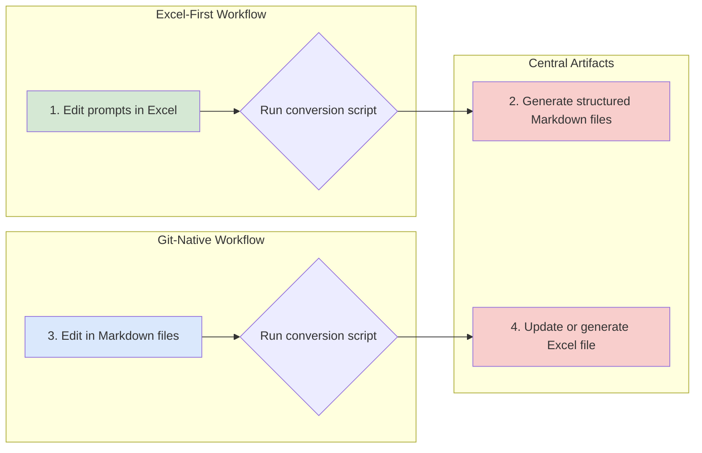
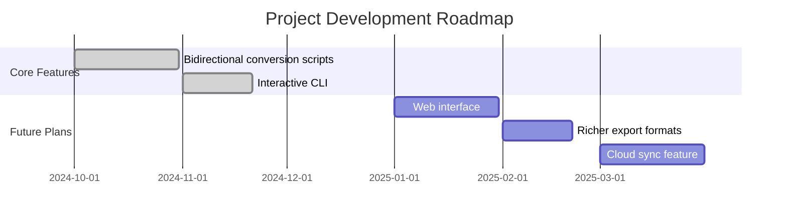

<!--
-------------------------------------------------------------------------------
  PROJECT HEADER SECTION
  This is the first thing users see. A polished banner or logo immediately elevates professionalism.
-------------------------------------------------------------------------------
-->
<p align="center">
  <!-- Recommended size: 1280x640px. Tools: Canva, Figma, or https://banners.beyondco.de/ -->
  
</p>

<div align="center">

# Prompt Library

**A comprehensive, high-quality AI prompt library supporting bidirectional conversion between Excel and Markdown formats.**

---

<!--
  BADGES SECTION
  Generate from https://shields.io/. Choose colors consistent with your brand.
  Recommended: build status, version, license, language, code size, downloads, community links, etc.
-->
<p>
  <a href="https://github.com/tukuaiai/prompt-library/actions/workflows/sync.yml"></a>
  <a href="https://github.com/tukuaiai/prompt-library/releases"></a>
  <a href="LICENSE"></a>
  <a href="https://github.com/tukuaiai/prompt-library"></a>
  <a href="https://github.com/tukuaiai/prompt-library"></a>
</p>

[✨ Features](#-features) •
[🚀 Quick Start](#-quick-start) •
[⚙️ API Reference](#️-api-reference) •
[🤝 Contributing](#-contributing) •
[🗺️ Roadmap](#️-roadmap)

</div>

<!--
-------------------------------------------------------------------------------
  OVERVIEW & VISUALS SECTION
  Showcase the most visual aspects of the project.
-------------------------------------------------------------------------------
-->

---

## 🖼️ Overview & Demo

This library is a structured, high-quality collection of AI prompts designed to provide powerful and flexible tools for developers, researchers, and content creators. Unlike many static prompt lists, this project provides a bidirectional conversion workflow, allowing users to seamlessly switch between collaboration-friendly Excel format and version-control-friendly Markdown format.

> **Core Philosophy**: Manage, share, and iterate high-quality prompts like code.

<p align="center">
  <!-- Recommend using GIF. Tools: ScreenToGif, GIPHY CAPTURE -->
  
</p>

---

<!--
-------------------------------------------------------------------------------
  MAIN CONTENT SECTION
  Detailed introduction of all aspects of the project.
-------------------------------------------------------------------------------
-->

## ✨ Features

- 📊 **Bidirectional Conversion**: Supports Excel ↔️ Markdown format conversion, balancing usability and version control.
- 🗂️ **Structured Management**: Contains multiple categories covering broad domains from software engineering to philosophical thinking.
- 🤖 **Multi-platform Compatible**: Prompts designed to be compatible with mainstream AI models like Claude, GPT, Gemini.
- 🛠️ **Automation Tools**: Provides command-line tools supporting batch conversion and management.
- 🎨 **Easily Extensible**: Conveniently add new prompts, categories, and custom attributes.

---

## ⚙️ Architecture & Workflow

The project workflow is built around a "data-centric" philosophy.


This workflow ensures that both non-technical people who prefer spreadsheets and developers comfortable with Git and code editors can collaborate efficiently.

---

## 🚀 Quick Start

### 1. Prerequisites

- [Python](https://www.python.org/) >= 3.8

### 2. Installation

<details>
<summary><b>Build from Source</b></summary>

```bash
git clone https://github.com/tukuaiai/prompt-library.git
cd prompt-library
pip install -r requirements.txt
```
</details>

### 3. Usage

<details>
<summary><b>Excel → Markdown Conversion</b></summary>

```bash
# Run interactive conversion
python3 main.py
```
The program will scan `.xlsx` files in the `prompt_excel` directory and let you select one for conversion. Results will be output to a timestamped folder under `prompt_docs`.
</details>

<details>
<summary><b>Markdown → Excel Conversion</b></summary>

```bash
# Run interactive conversion
python3 main.py
```
The program will scan the `prompt_docs` directory, let you select a document set, then convert it back to an Excel file, outputting to a timestamped folder under `prompt_excel`.
</details>

<details>
<summary><b>Non-interactive Conversion</b></summary>

```bash
# Specify Excel file to convert
python3 main.py --select "prompt_excel/your_file.xlsx"

# Specify Markdown directory to convert
python3 main.py --select "prompt_docs/your_docs_folder"
```

</details>

---

<details>
<summary>❓ FAQ (Optional)</summary>

- **Q: Why does conversion fail?**
  - **A:** Please ensure your Excel file format matches the provided examples, especially the sheet names and column headers.

- **Q: Can I add my own conversion logic?**
  - **A:** Absolutely. The core logic is located in the `scripts/` directory, and you're free to modify or extend them.

</details>

---

<!--
-------------------------------------------------------------------------------
  COMMUNITY & GOVERNANCE SECTION
  Demonstrate project health and development direction.
-------------------------------------------------------------------------------
-->

## 🗺️ Roadmap



---

## 🤝 Contributing

We warmly welcome all forms of contribution! If you have any ideas or suggestions for this project, please feel free to open an [Issue](https://github.com/tukuaiai/prompt-library/issues) or submit a [Pull Request](https://github.com/tukuaiai/prompt-library/pulls).

Before you start, please take a moment to read our [**Contributing Guide (CONTRIBUTING.md)**](CONTRIBUTING.md) and [**Code of Conduct (CODE_OF_CONDUCT.md)**](CODE_OF_CONDUCT.md).

### ✨ Contributors

Thanks to all the developers who have contributed to this project!

<a href="https://github.com/tukuaiai/prompt-library/graphs/contributors">
  
</a>

---

## 🛡️ Security Policy

We take the security of this project very seriously. If you discover any security vulnerabilities, please don't discuss them publicly. Instead, contact us via email at `tukuaiai@example.com`.

---

<!--
-------------------------------------------------------------------------------
  FOOTER SECTION
  Final call to action and acknowledgments.
-------------------------------------------------------------------------------
-->

## 📜 License

This project is licensed under the [MIT](LICENSE) License.

---

<div align="center">

**If this project has been helpful to you, please don't hesitate to give us a Star ⭐!**

<!-- Star History: https://star-history.com/ -->
<a href="https://star-history.com/#tukuaiai/prompt-library&Date">
  
</a>

<br>

**Made with ❤️ by tukuaiai**

[⬆ Back to Top](#prompt-library)

</div>
